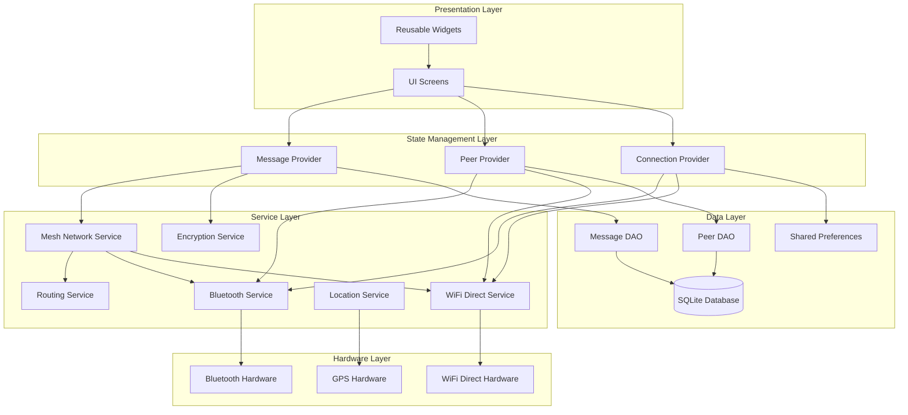
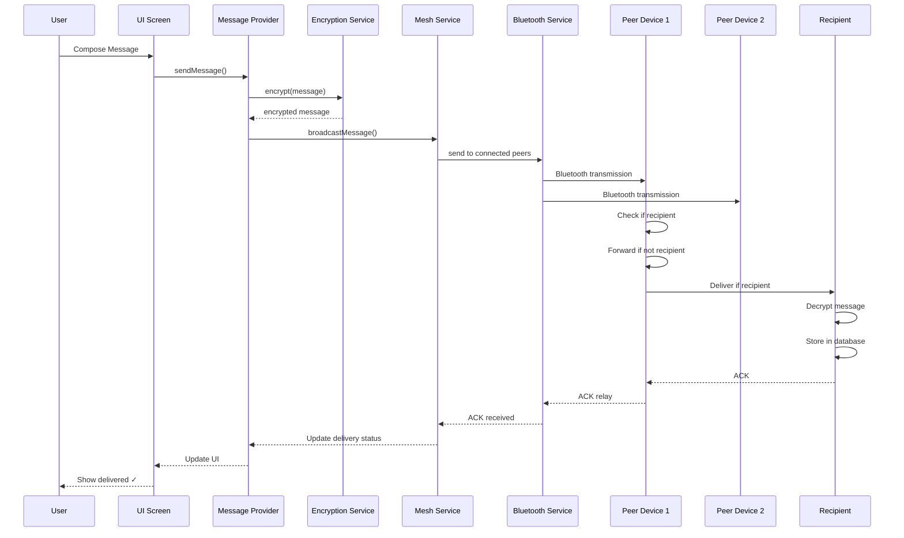
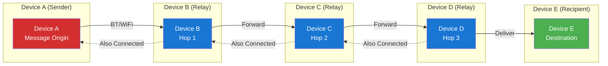
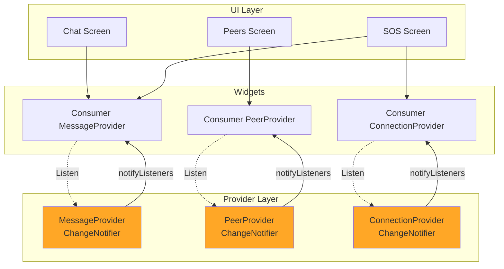
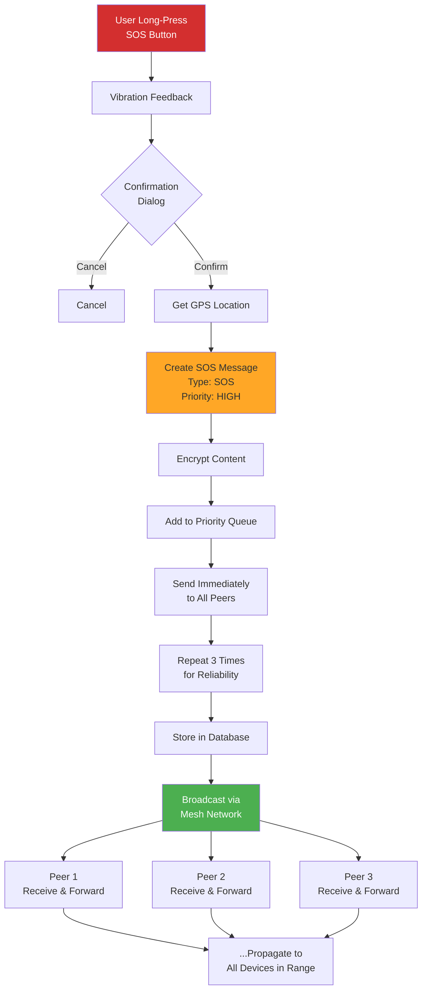
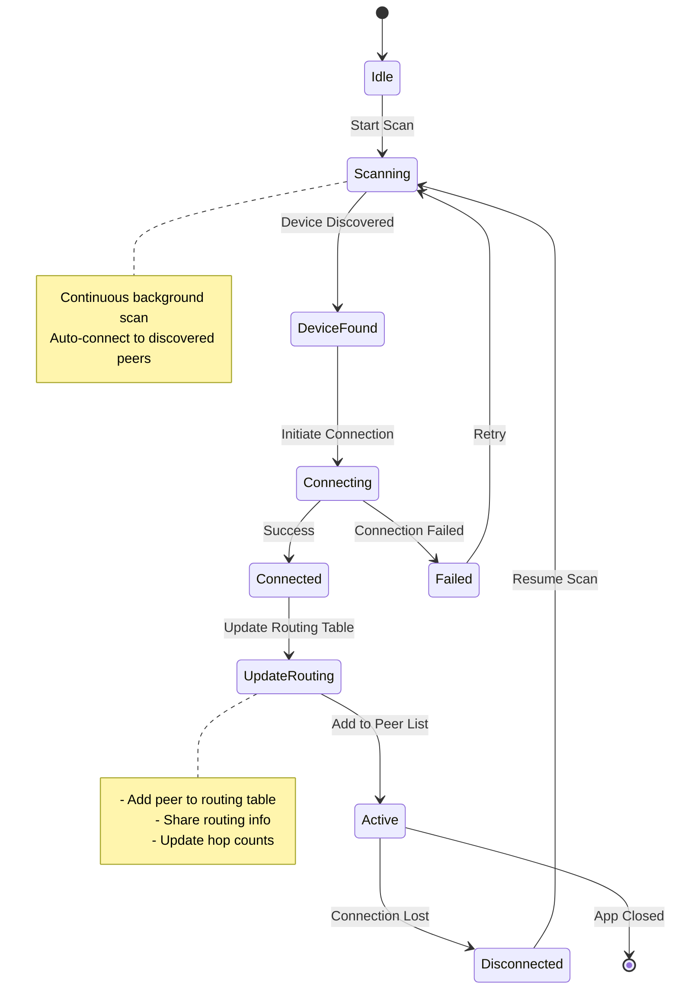
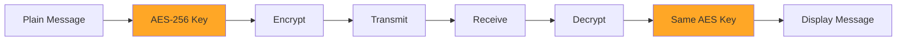

# Emergency Offline Communication System - Architecture Documentation

## System Architecture Overview

This document describes the technical architecture of the Emergency Offline Communication System, including system design, data flow, and component interactions.

---

## 1. Overall System Architecture



---

## 2. Message Flow Diagram



---

## 3. Mesh Network Topology



### Mesh Network Rules:
- **TTL (Time to Live)**: Max 5 hops
- **Flooding Algorithm**: Broadcast to all connected peers
- **Duplicate Prevention**: Message ID tracking with LRU cache
- **Routing Table**: Dynamic updates based on peer availability

---

## 4. State Management Flow (Provider Pattern)



---

## 5. SOS Alert Propagation



---

## 6. Device Discovery Process



---

## 7. Database Schema

### Messages Table
```sql
CREATE TABLE messages (
  id TEXT PRIMARY KEY,              -- UUID
  content TEXT NOT NULL,            -- Encrypted message content
  sender_id TEXT NOT NULL,          -- Sender UUID
  recipient_id TEXT NOT NULL,       -- Recipient UUID
  timestamp INTEGER NOT NULL,       -- Unix timestamp
  is_delivered INTEGER DEFAULT 0,  -- Boolean (0/1)
  hop_count INTEGER DEFAULT 0,      -- Number of hops
  message_type TEXT NOT NULL        -- TEXT|SOS|ACK
);
```

### Peers Table
```sql
CREATE TABLE peers (
  peer_id TEXT PRIMARY KEY,         -- Peer UUID
  device_name TEXT NOT NULL,        -- Device name
  last_seen INTEGER NOT NULL,       -- Last seen timestamp
  is_connected INTEGER DEFAULT 0,   -- Boolean (0/1)
  connection_type TEXT              -- BLUETOOTH|WIFI
);
```

### Locations Table
```sql
CREATE TABLE locations (
  id INTEGER PRIMARY KEY AUTOINCREMENT,
  message_id TEXT NOT NULL,         -- Foreign key to messages
  latitude REAL NOT NULL,           -- GPS latitude
  longitude REAL NOT NULL,          -- GPS longitude
  accuracy REAL,                    -- GPS accuracy in meters
  FOREIGN KEY (message_id) REFERENCES messages(id)
);
```

---

## 8. Message Packet Structure

### Standard Packet Format (JSON)
```json
{
  "id": "550e8400-e29b-41d4-a716-446655440000",
  "type": "TEXT|SOS|ACK",
  "content": "Encrypted message content",
  "senderId": "a1b2c3d4-e5f6-7890-1234-567890abcdef",
  "recipientId": "f1e2d3c4-b5a6-9870-4321-0fedcba09876",
  "timestamp": 1699564800000,
  "hopCount": 0,
  "ttl": 5,
  "latitude": 23.8103,
  "longitude": 90.4125
}
```

### Field Descriptions:
- **id**: Unique message identifier (UUID v4)
- **type**: Message type (TEXT, SOS, or ACK)
- **content**: Encrypted message payload
- **senderId**: Originating device ID
- **recipientId**: Destination device ID
- **timestamp**: Creation time (Unix milliseconds)
- **hopCount**: Number of hops from origin
- **ttl**: Time to Live (decrements each hop, max 5)
- **latitude/longitude**: GPS coordinates (optional)

---

## 9. Component Responsibilities

### Presentation Layer
- **Screens**: Handle user interaction and display
- **Widgets**: Reusable UI components
- **Navigation**: Route management

### State Management
- **Providers**: Manage app state and notify listeners
- **ChangeNotifier**: Reactive state updates

### Service Layer
- **Bluetooth Service**: Device discovery, connection management
- **WiFi Direct Service**: WiFi P2P communication
- **Mesh Network Service**: Message routing, forwarding logic
- **Location Service**: GPS tracking
- **Encryption Service**: AES-256 encryption/decryption
- **Routing Service**: Route calculation, duplicate prevention

### Data Layer
- **Database Helper**: SQLite initialization
- **DAOs**: Data access objects for CRUD operations
- **Models**: Data classes with serialization

---

## 10. Key Design Patterns

1. **Repository Pattern**: Abstraction over data sources
2. **Provider Pattern**: State management and dependency injection
3. **Singleton Pattern**: Database instance, service instances
4. **Factory Pattern**: Model creation from JSON/Map
5. **Observer Pattern**: State change notifications via ChangeNotifier

---

## 11. Security Architecture



### Security Features:
- **Encryption**: AES-256 for message content
- **Key Storage**: Secure storage using flutter_secure_storage
- **Key Exchange**: Pre-shared key (simple implementation)
- **Data Integrity**: Message checksum validation

---

## Technology Stack Summary

| Layer | Technology |
|-------|-----------|
| Framework | Flutter 3.10+ |
| Language | Dart |
| Database | SQLite (sqflite) |
| Bluetooth | flutter_blue_plus |
| WiFi Direct | wifi_iot (Android only) |
| Location | geolocator |
| Encryption | encrypt (AES) |
| State Management | Provider |
| Storage | shared_preferences |

---

**Document Version**: 1.0  
**Last Updated**: Week 2 - System Design Phase

